# Single Image Haze Removal
Implementation of KaiMing He CVPR09 Best Paper <br>
Replace Laplacian Matrix part by KaiMing He ECCV10 Guided Filter
* [Single Image Haze Removal using Dark Channel Prior](http://kaiminghe.com/publications/cvpr09.pdf)
* [Guided Image Filtering](http://kaiminghe.com/publications/eccv10guidedfilter.pdf)


## Requirements
* opencv3
* opencv3-contrib
* skimage
* numpy
* matplotlib


pip installable package in requirements.txt(except opencv), please use
```
pip install requirements.txt
```

## Usage
See the command output
```
python main.py --help
```

## Result

Original|Dark Channel|Raw Transmission Map|Transmission Map After Guided Filter|Output|Output with histrogram equalization
---|---|---|---|---|---
|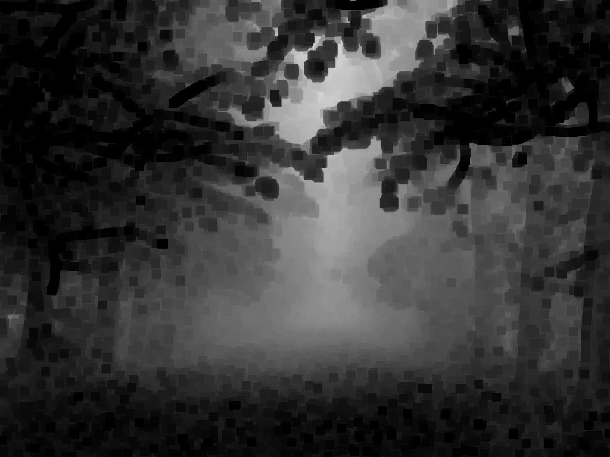||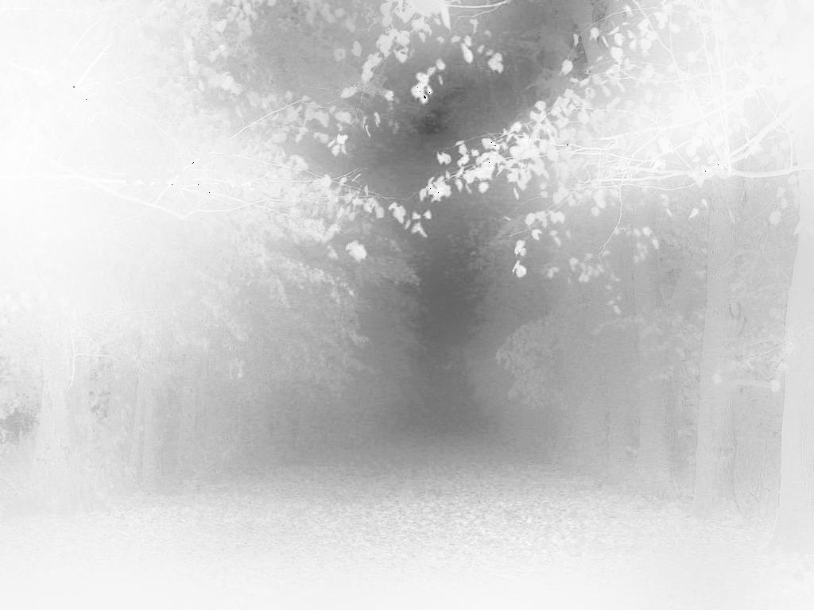|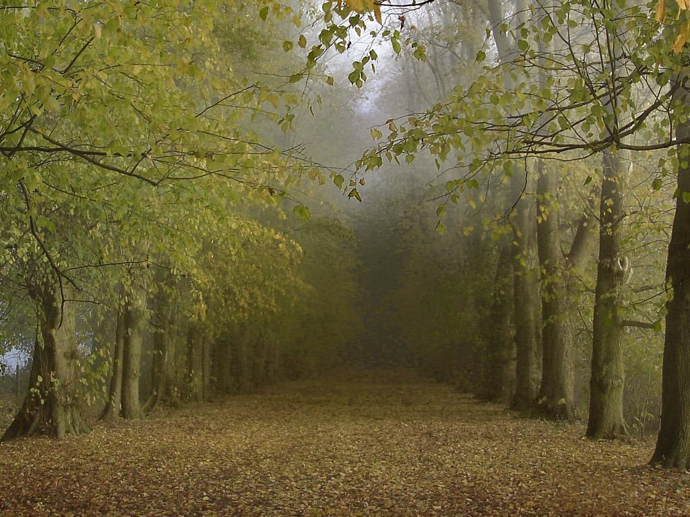|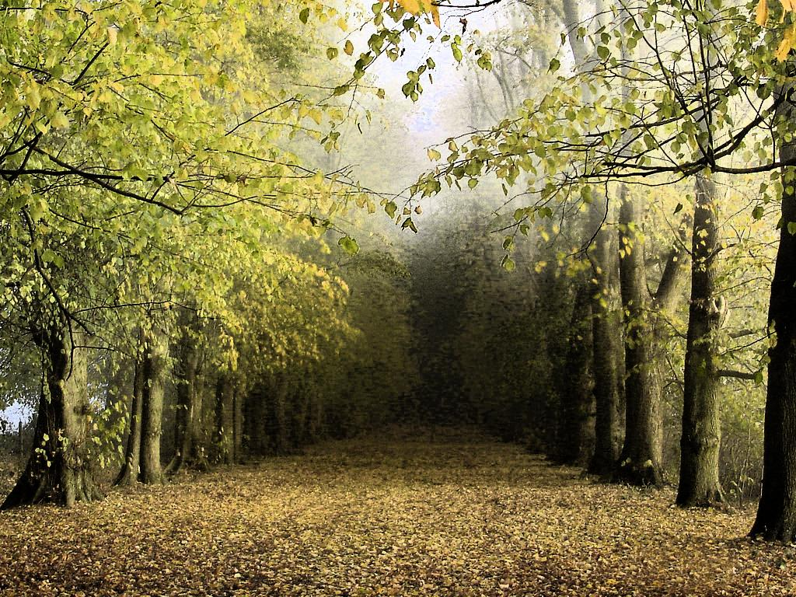
|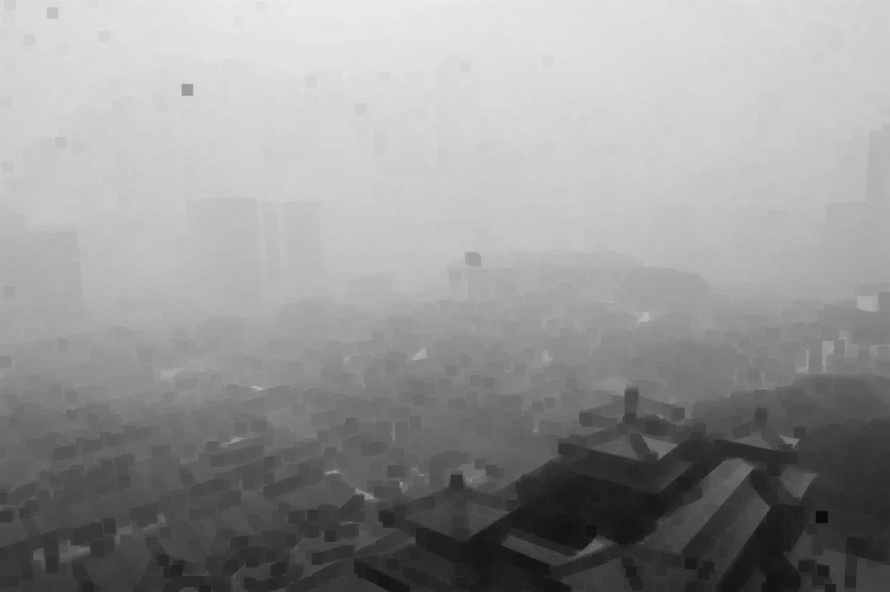|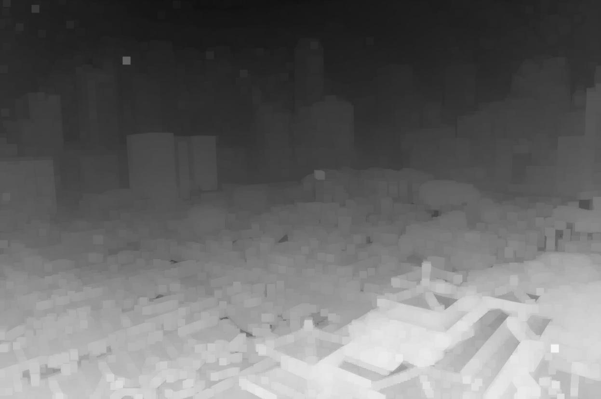|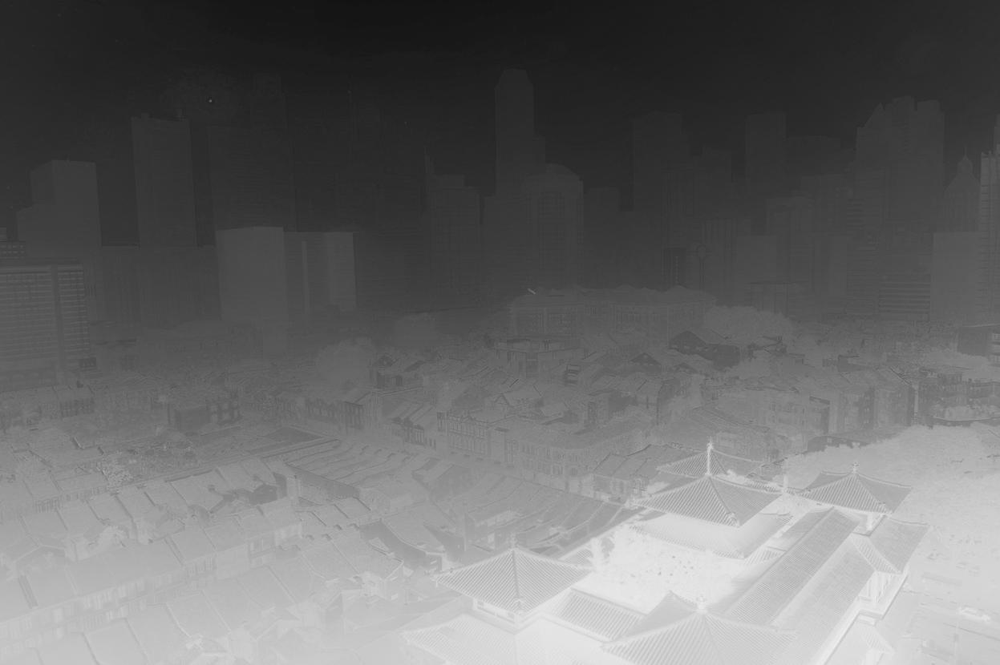|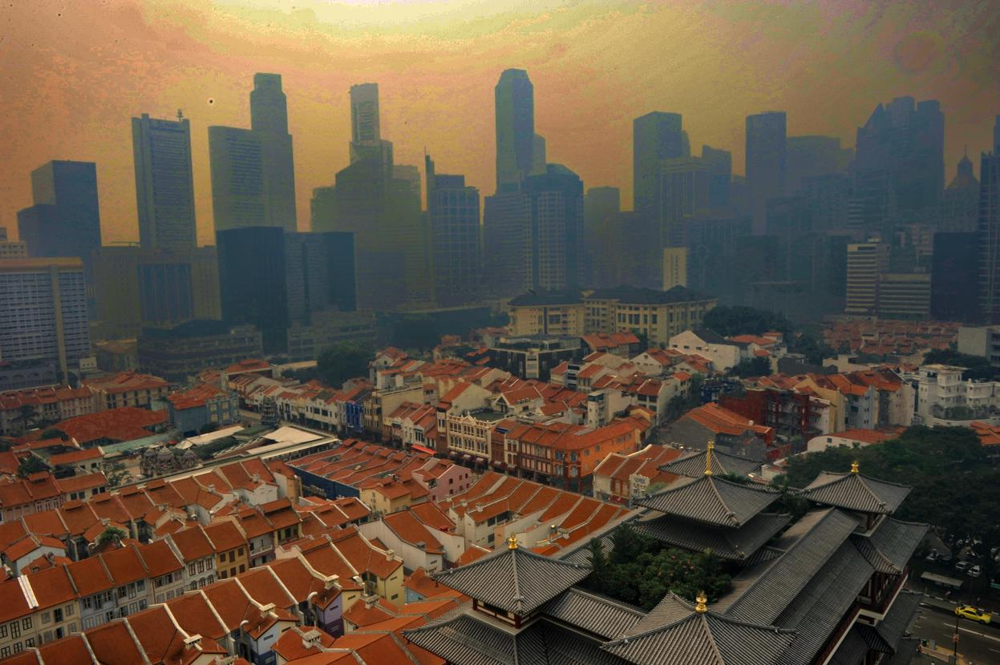|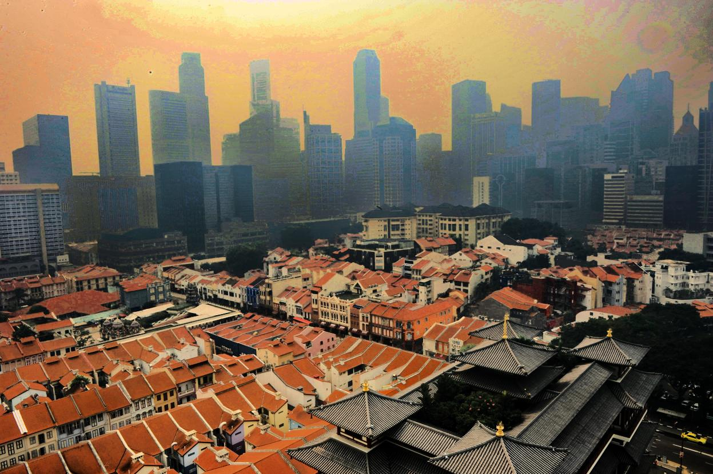
|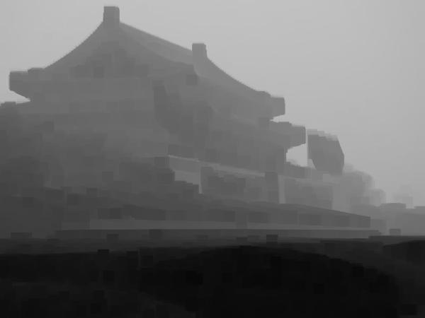|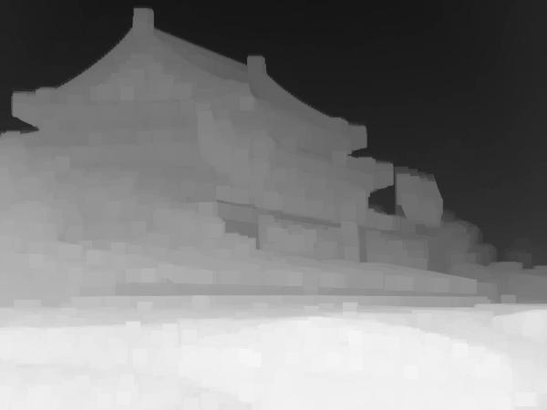|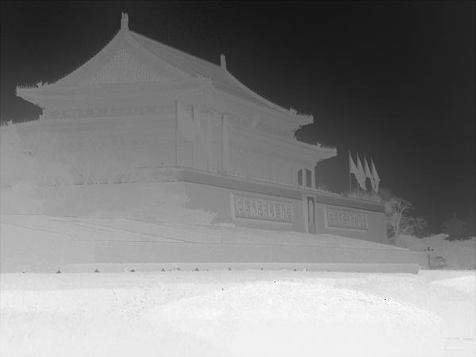|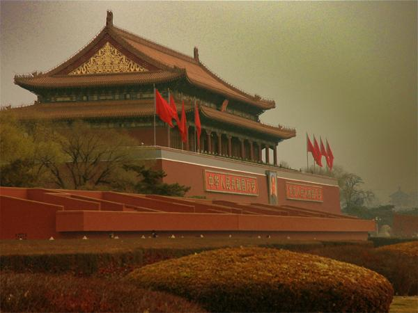|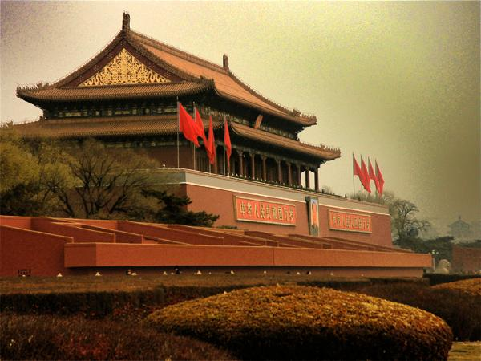
